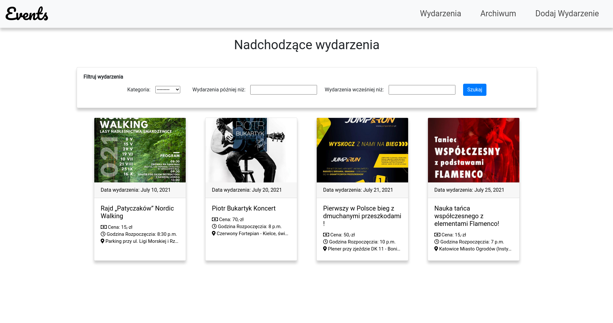
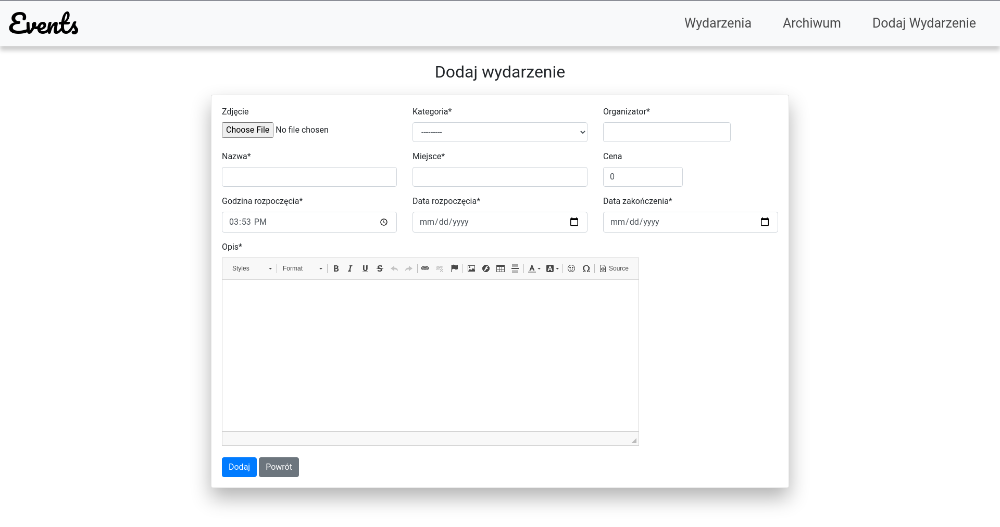
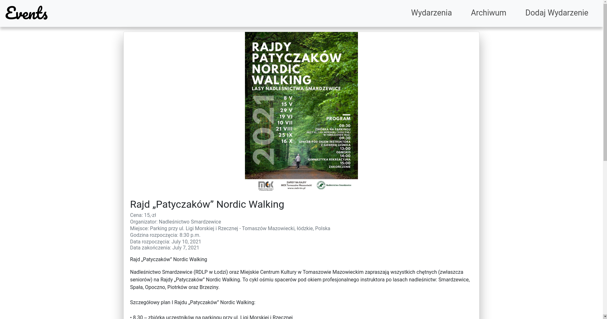

# Events

Website to show info about upcoming events.


	
## How to run 

```
$ git clone https://github.com/dzania/Events.git
$ cd Events
$ pip install requirements.txt
$ python3 manage.py runserver
```


